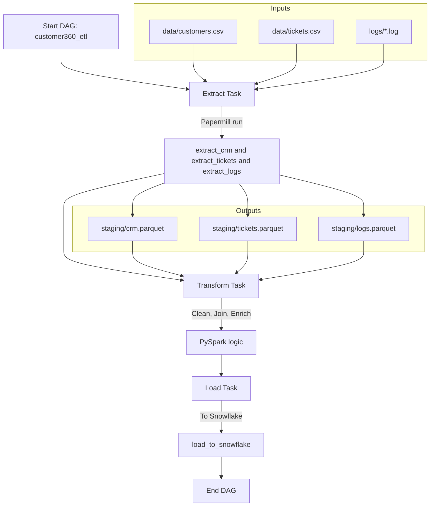

# 🧠 Customer 360 Data Platform (Dockerized ETL with Airflow + Spark + Snowflake)

This project builds an **end-to-end, containerized ETL data platform** that extracts data from CSV files using parameterized Jupyter notebooks (via Papermill), transforms them using **PySpark**, and loads the final datasets into **Snowflake** — all orchestrated through **Apache Airflow**.

> 📦 Built with modularity, reproducibility, and cloud-readiness in mind.

---

## 🚀 Tech Stack

| Layer        | Tool / Service                             |
|--------------|---------------------------------------------|
| Orchestration| **Apache Airflow** (v3.x)                   |
| Transformation | **PySpark** (runs in Jupyter)           |
| Extraction   | **Papermill** (parameterized notebooks)     |
| Load         | **Snowflake** (cloud data warehouse)        |
| Versioning   | **GitHub** + GitHub Actions (CI/CD)         |
| Containerization | **Docker**, `docker-compose`          |
| Notebook UI  | **JupyterLab**                              |

---

## 🔁 ETL Workflow




## 📁 Project Structure

```bash
├── airflow/
│   └── dags/
│       └── customer360_etl.py      # Airflow DAG
├── work/
│   └── etl/
│       ├── extract.ipynb           # Extract logic
│       ├── transform.ipynb         # PySpark logic
│       ├── load.ipynb              # Load to Snowflake
│       └── out_*.ipynb             # Papermill outputs
│
├── data/                           # Raw input CSVs
│   ├── customers.csv
│   ├── tickets.csv
│   └── logs.csv
├── staging/                        # Transformed .parquet files
├── docker-compose.yml
└── README.md
```

---

## ⚙️ Setup Instructions

### 1. Clone the Repo
```bash
git clone https://github.com/yourusername/customer360-etl.git
cd customer360-etl
```

### 2. Start the Project
```bash
docker-compose up -d
```

Wait 1–2 minutes for Airflow to initialize.

---

## 🛠️ Key Tools & Commands

### 🔄 Airflow (3.x)

| Command                            | Purpose                          |
|------------------------------------|----------------------------------|
| `airflow dags list`                | List all DAGs                    |
| `airflow dags trigger <dag_id>`    | Manually run a DAG               |
| `airflow tasks list <dag_id>`      | View all tasks in DAG            |
| `airflow tasks states-for-dag-run` | View task status for a run       |
| `airflow tasks test`               | Test individual task logic       |

Use inside the container:
```bash
docker exec -it airflow-webserver bash
```

### 📒 Jupyter Notebooks
Visit: `http://localhost:8888` (token auto printed on container start)

- Notebooks are executed automatically by Airflow using `papermill`.

---

## 📊 What This DAG Does

| Task                  | Description                               |
|-----------------------|-------------------------------------------|
| `extract_csvs`        | Reads raw CSVs → saves as `.parquet`      |
| `transform_with_spark`| Cleans, deduplicates data using PySpark   |
| `load_to_snowflake`   | Uploads processed data into Snowflake     |

---

## ✅ Tips & Best Practices

- Keep your notebooks **modular**. Each stage (extract/transform/load) is its own `.ipynb`.
- Use **absolute paths** inside notebooks (especially for Airflow + Papermill).
- Make sure your `staging/` and `data/` folders exist **before running**.
- Airflow retries failed tasks by default. Check `logs/` for details.
- You can inspect `.out_extract.ipynb` for notebook execution results.
- If you get an error during airflow scheduler, It's probably becuase  .ipynb_checkpoints/customer360_etl-checkpoint.py. Make sure to delete the copy
  ```bash
  rm /home/jovyan/airflow/dags/.ipynb_checkpoints/customer360_etl-checkpoint.py
  airflow dags reserialize
  airflow scheduler
  ```
- The project requires openjdk version "17.0.8.1" and Python 3.11.6

---

---

## 🧊 Snowflake Integration

Ensure `.env` or Airflow connections are set up with:
- `SNOWFLAKE_ACCOUNT`
- `SNOWFLAKE_USER`
- `SNOWFLAKE_PASSWORD`
- `SNOWFLAKE_DATABASE`
- `SNOWFLAKE_SCHEMA`
- `SNOWFLAKE_WAREHOUSE`

---

## 🧼 Cleanup

To stop and remove containers:
```bash
docker-compose down
```

To clear Airflow state:
```bash
docker-compose down -v
```

---

## 👨‍🔬 Author

Built by **Dinesh Udayan** — Cybersecurity + Data Engineering Enthusiast  
🛠 Connect on [LinkedIn](https://linkedin.com/in/dinesh-udayan) | 🐙 [GitHub](https://github.com/Dinesh1599)

---

## 📌 License

MIT License
